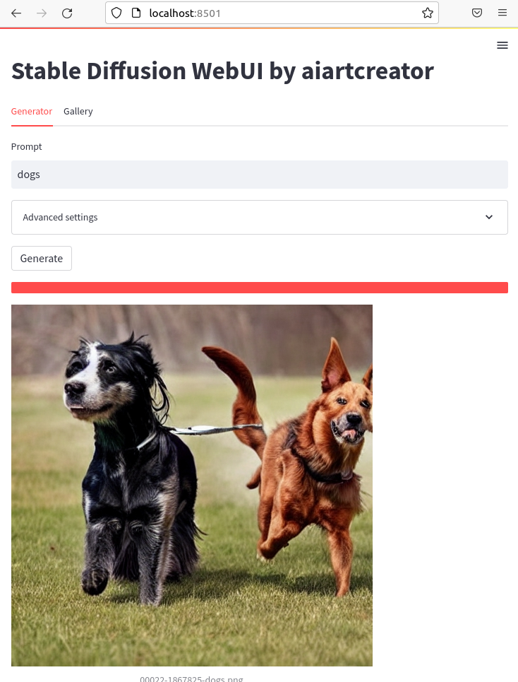
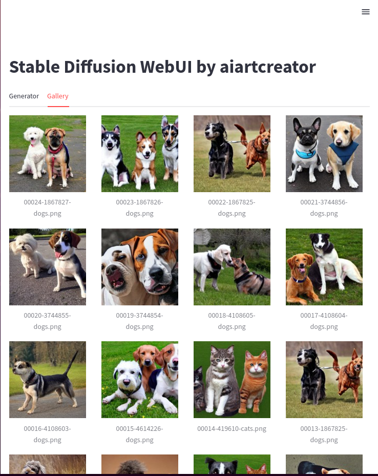
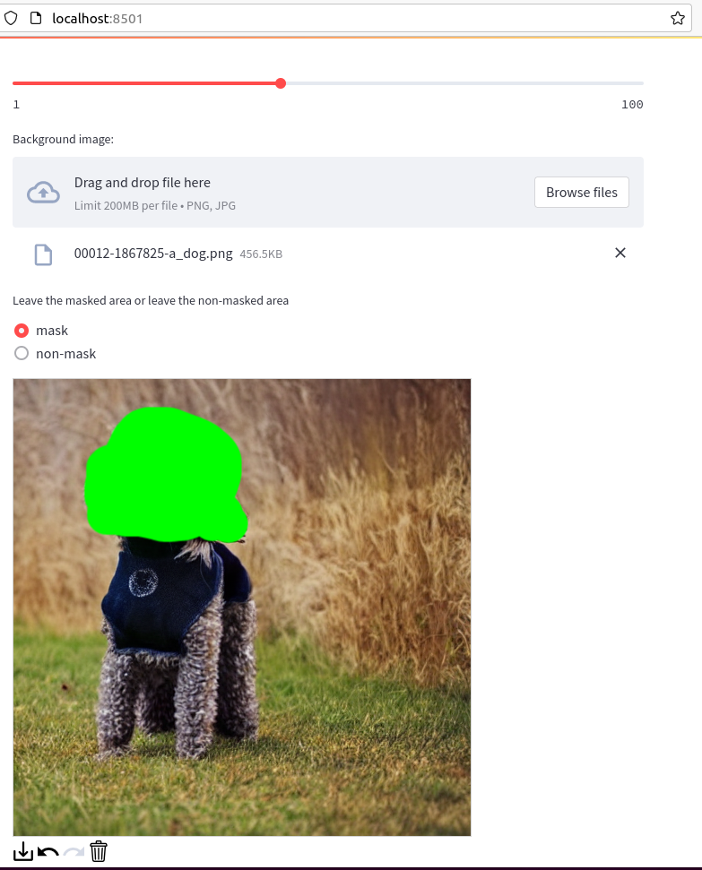

# StableDiffusionStreamlitWebUI
Stable DiffusionのWebアプリをStreamlitを用いて作成しました  
[](https://twitter.com/aiartcreator824)

# どんなことができるか
1. Stable Diffusionのtxt2imgをWebブラウザ上で実行できます
2. inpainting(画像中からマスクした領域の物体を消去する)タスクも実行可能
2. 複数枚画像を生成した場合は、できた画像から表示されていきます
3. 今までに作成した画像のギャラリーを見ることができます
4. 作成した画像のファイル名にシード値とプロンプトが記載してあるので、その値を入力するともう一度同じ画像を生成できます

# ギャラリー
  



# 環境構築
1. 前提としてStable Diffusionをローカルにインストール済みであるとします
2. Stable Diffusionのフォルダのscriptsフォルダにこのリポジトリのwebui.pyとtxt2img4webui.py、inpaint.pyをコピーします
3. Stable Diffusionの環境に追加のライブラリをインストールします( pip install streamlit==1.12.0 streamlit-drawable-canvas==0.9.1)
4. ※Inpaintを使用する場合 [ここ](https://github.com/CompVis/latent-diffusion#inpainting)に書いてあるとおり、
```
wget -O models/ldm/inpainting_big/last.ckpt https://heibox.uni-heidelberg.de/f/4d9ac7ea40c64582b7c9/?dl=1
```
を実行

# 実行方法
Stable Diffusionのフォルダ上で
```
streamlit run scripts/webui.py
```
と実行します。  
するとWebサーバが起動するので、 http://localhost:8501 のアドレスをWebブラウザで開くとアプリが表示されます。
